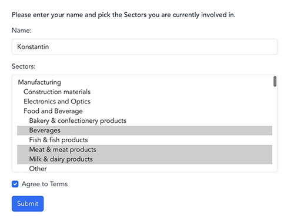

# Form Handler Application

## Introduction

This Form Handler application is designed to streamline the process of submitting information through a dynamic form,
focusing on sectors selection, session management, and data persistence using modern web technologies.



## Prerequisites

Before you begin, ensure your system meets the following requirements:

- Java: v21.0.2
- Gradle: v8.5
- Node.js: v20.11.1
- npm: v10.2.4
- Docker: v25.0.2
- Docker Compose: v2.24.3

## Technical Stack

- **Backend**: Spring Boot v3.2
- **Frontend**:
    - **Build Tool**: Vite is used as the build tool for the frontend, leveraging its fast build times and efficient module replacement to enhance the development experience.
    - Vue.js v3.2
    - Bootstrap v5.3
- **Database**: PostgreSQL for data persistence and Flyway for database migration management.
- **Caching and Session Storage**: Redis, utilized for its performance benefits.
- **Testing**: A combination of MockMvc, Testcontainers, Mockito, AssertJ, and JUnit for robust testing coverage.

## Database Design

Our application utilizes three main tables to manage sectors, profiles, and the relationship between them. Below is an
overview of each table and their relationships:

### Tables Overview

- **`sector`**: Stores information about sectors. Each sector can have a parent sector, enabling a hierarchical
  structure.
    - **Columns**:
        - `id`: The primary key.
        - `name`: The name of the sector.
        - `parent_id`: Reference to another sector (self-referencing), allowing for sector hierarchy.
        - `created_at` & `updated_at`: Timestamps for record creation and updates.

- **`profile`**: Contains user profiles who have selected sectors and agreed to terms.
    - **Columns**:
        - `id`: The primary key.
        - `name`: Name of the user.
        - `agree_to_terms`: Boolean indicating agreement to terms.
        - `session_id`: Unique session ID for the user.
        - `created_at` & `updated_at`: Timestamps for record creation and updates.

- **`profile_sector`**: A junction table that links profiles to their selected sectors.
    - **Columns**:
        - `profile_id`: References the `profile` table.
        - `sector_id`: References the `sector` table.
        - Composite primary key (`profile_id`, `sector_id`) ensures unique associations.

### Relationships

- A **profile** can select multiple **sectors**, and a **sector** can be associated with multiple **profiles**,
  establishing a many-to-many relationship through the **profile_sector** table.
- **sectors** can have a hierarchical structure, where each **sector** may reference another **sector** as its parent.

## API Documentation

The application provides comprehensive API documentation using OpenAPI 3.0. You can access this documentation at:

- When running the application with Docker Compose: [http://localhost:8080/swagger-ui/index.html](http://localhost:8080/swagger-ui/index.html)
- When running the application directly through IntelliJ: [http://localhost:8081/swagger-ui/index.html](http://localhost:8081/swagger-ui/index.html)

## Setup and Running Instructions

### Docker Containers Setup

Initialize necessary Docker containers with Docker Compose tools to ensure the database and Redis services are up before
proceeding:

```bash
docker-compose up -d
```

This step is crucial, especially before moving to production build, to ensure all dependent services are available.

### Backend Setup

Navigate to the backend directory and compile the Java application using Gradle:

```bash
./gradlew clean build
./gradlew bootRun
```

### Frontend Setup

Install frontend dependencies and start the development server:

```bash
npm install
npm run dev
```

## Running in Production

To run the application in production, you can use Docker Compose. This simplifies the deployment process by
orchestrating the startup of your application and its dependencies with a single command.

### Steps:

1. **Prepare the Environment:** Ensure all configuration files are correctly set up for production. This may
   include `.env` files or specific changes within `docker-compose.yml`.

2. **Build and Run with Docker Compose:** Navigate to the root directory of your project where the `docker-compose.yml`
   file is located. Run the following command:

```bash
docker-compose -f docker-compose.yml up -d
```

This command will start all services defined in your `docker-compose.yml` file in detached mode, running in the
background.

3. **Verify the Deployment:** Ensure all services are up and running. You can check the status of your Docker containers
   by executing:

```bash
docker ps
```

For logs and troubleshooting, use:

```bash
docker-compose -f docker-compose.yml logs
```

Replace `<service_name>` with the name of the service you want to inspect.

### Updating the Application

To update the application or its services after making changes:

1. Rebuild the services:

```bash
docker-compose -f docker-compose.yml build
```

2. Restart the services for the changes to take effect:

```bash
docker-compose -f docker-compose.yml up -d
```

## Continuous Integration and Deployment

- A CI pipeline via GitHub Actions in the `.github` folder automates unit and integration tests.
- Dependabot keeps Maven and GitHub Actions versions up-to-date, automating dependency management.

## Note on Development Tools

- **Spring Boot DevTools** and **Actuator** provide enhanced development and monitoring capabilities.
- **Project Lombok** minimizes boilerplate code, improving code clarity and maintainability.
- This project is utilizing **Docker Compose support** introduced in Spring Boot 3.1.
- **Bootstrap** is used for frontend design, offering a wide range of responsive, mobile-first components.

## Key Features

- **Form Validation**: Ensures all required fields are filled before submission.
- **Dynamic Sector Selection**: Populates sectors from the database, offering real-time updates.
- **Data Persistence**: Securely stores submission data, allowing session-based edits.

---

This README aims to guide developers through setting up, running, and understanding the core functionalities and
technical aspects of the Form Handler application.
